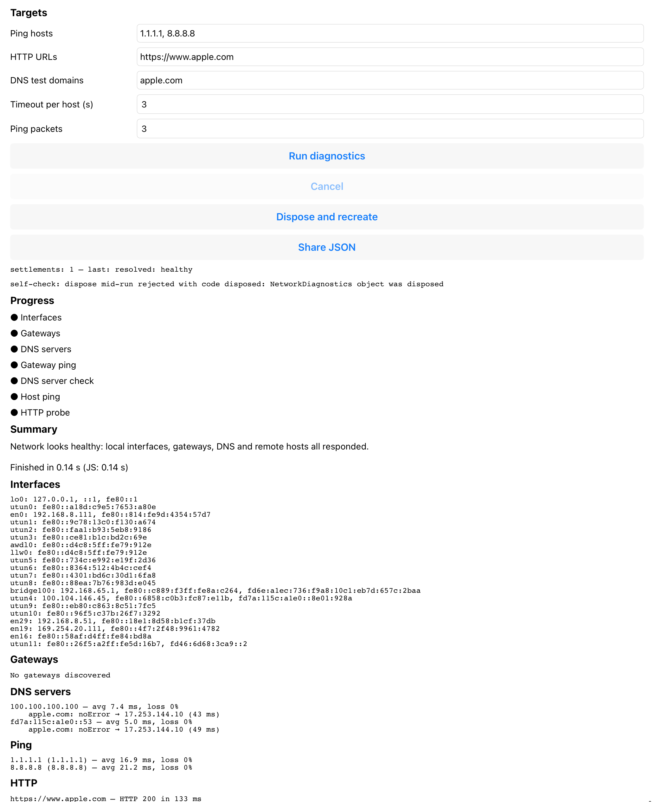

# tabris-plugin-network-diagnostics

Network diagnostics for Tabris.js apps on iOS: interfaces, gateways, DNS servers,
ICMP ping, direct DNS queries, HTTP probes, and an all-in-one diagnosis with a
verdict. Swift port of `ios-network-diagnostics`.

> [!IMPORTANT]
> **This plugin configures nothing in your application. Three entries are yours to add.**
> Without the first two it does not compile. Without the third its local network probes —
> the gateway ping and the DNS server queries — fail on a device, and nothing warns you at
> install time.

Add to your app's `config.xml`:

```xml
<!-- iOS 16 for ContinuousClock and Task.sleep(for:), plus a Swift version.
     A generated Tabris project declares neither. -->
<preference name="deployment-target" value="16.0" />
<preference name="SwiftVersion" value="5.0" />

<platform name="ios">
  <!-- Shown by iOS the first time the app contacts the local network. Write it for
       your own users; this wording is only the example's. -->
  <edit-config target="NSLocalNetworkUsageDescription" file="*-Info.plist" mode="merge">
    <string>Pings the router and queries the DNS servers on the local network to diagnose connectivity.</string>
  </edit-config>
</platform>
```

[`example/cordova/config.xml`](example/cordova/config.xml) is a working copy of all three.



## Install

```xml
<!-- config.xml -->
<plugin name="tabris-plugin-network-diagnostics"
        spec="git+https://github.com/eclipsesource/tabris-plugin-network-diagnostics.git" />
```

## TypeScript

The plugin ships type declarations (`types/index.d.ts`) for the global `es`
namespace it installs. `tabris build` compiles the app **before** Cordova adds
any plugin, so the declarations have to reach the compiler through npm, as a
devDependency of the app; the `<plugin>` entry above still supplies the runtime
object. Both point at the same version.

```bash
npm install --save-dev git+https://github.com/eclipsesource/tabris-plugin-network-diagnostics.git
```

```jsonc
// tsconfig.json
{"compilerOptions": {"types": ["tabris-plugin-network-diagnostics"]}}
```

Every `.ts` file then sees `es.NetworkDiagnostics`, `es.Report`, `es.PingOutcome`
and the other shapes below. Alternatively, one file can carry
`/// <reference types="tabris-plugin-network-diagnostics" />` instead of the
tsconfig entry. Do not `import` the package: the import would survive into the
compiled JavaScript as a `require()` of a package the app bundle does not carry.
Rejections are typed as `es.NetworkDiagnosticsError`, whose `code` is one of the
codes listed under Errors. [`example_typescript/`](example_typescript/) is a
working copy of this setup.

## Quick start

```js
const diagnostics = new es.NetworkDiagnostics();

diagnostics.on('pingResult', ({host, outcome}) => console.log(host, outcome.state));

const report = await diagnostics.diagnose({
  pingHosts: ['1.1.1.1', '8.8.8.8'],
  httpHosts: ['https://www.apple.com'],
  dnsTestDomains: ['apple.com'],
  timeoutPerHostSeconds: 3, // default
  pingPacketCount: 3,       // default
  httpMethod: 'HEAD'        // default, or 'GET'
});

console.log(report.summary.verdict, report.summary.message);
```

## Primitives

```js
await diagnostics.interfaces();                                    // NetworkInterface[]
await diagnostics.gateways({timeoutSeconds: 3});                   // Gateway[] (discovery only, no ping)
await diagnostics.dnsServers();                                    // ['192.168.0.1', 'fd00::1']
await diagnostics.ping('1.1.1.1', {packetCount: 3, timeoutSeconds: 3});          // PingResult
await diagnostics.dnsQuery('apple.com', {server: '192.168.0.1', timeoutSeconds: 3}); // DnsQueryResult
await diagnostics.http('https://www.apple.com', {method: 'HEAD', timeoutSeconds: 3}); // HttpResult
```

`dnsQuery` needs an explicit `server`; compose it: `const [server] = await diagnostics.dnsServers();`

## Events (fired while `diagnose()` runs)

```js
diagnostics.on('stageStarted',    ({stage}) => {});                       // see stages below
diagnostics.on('stageFinished',   ({stage}) => {});
diagnostics.on('gatewayResult',   ({address, interfaceName, ping}) => {});
diagnostics.on('dnsServerResult', ({address, ping, queries}) => {});
diagnostics.on('pingResult',      ({host, resolvedAddress, outcome}) => {});
diagnostics.on('httpResult',      ({url, outcome}) => {});
```

Stages, in order: `interfaces`, `gateways`, `dnsServers` (parallel), then `gatewayPing`,
`dnsServerCheck`, `hostPing`, `httpProbe` (parallel).

## Cancel and dispose

```js
await diagnostics.cancel();   // the running diagnose() rejects with code 'cancelled'
diagnostics.dispose();        // every pending call rejects with code 'disposed'
```

One `diagnose()` per object at a time; a second call rejects with `alreadyRunning`.
Primitives run concurrently and are not affected by `cancel()`.

## Errors

```js
try {
  await diagnostics.ping('');
} catch (error) {
  error.code;    // 'invalidParameter'
  error.message; // 'host must be a non-empty string, received ""'
}
```

| `error.code` | When |
|--------------|------|
| `invalidParameter` | Malformed input; the message names the key and the received value |
| `unavailable` | `interfaces()`, `gateways()`, `dnsServers()` when the system lookup fails |
| `alreadyRunning` | `diagnose()` while a run is in flight on the same object |
| `cancelled` | `cancel()` while `diagnose()` is running |
| `disposed` | `dispose()` with calls in flight |

Probe failures (`ping`, `dnsQuery`, `http`, and every item inside the report) are
values in `outcome.state`, never rejections.

## Result shapes

| Shape | Fields |
|-------|--------|
| `NetworkInterface` | `name`, `ipv4Addresses: string[]`, `ipv6Addresses: string[]`, `isUp`, `isLoopback` |
| `Gateway` | `address`, `interfaceName` (or `null`) |
| `PingResult` | `host`, `resolvedAddress` (or `null`), `outcome: PingOutcome` |
| `DnsQueryResult` | `domain`, `server`, `outcome: DnsQueryOutcome`, `isResolved` |
| `HttpResult` | `url`, `outcome: HttpOutcome` |

| Outcome | `state` | Extra fields |
|---------|---------|--------------|
| `PingOutcome` | `reachable` | `sentPackets`, `receivedPackets`, `minRttMs`, `avgRttMs`, `maxRttMs`, `packetLossPercent` |
| | `unreachable` | `sentPackets` |
| | `resolutionFailed` | `reason` |
| | `failed` | `reason` |
| `DnsQueryOutcome` | `answered` | `responseCode` (`noError`, `formatError`, `serverFailure`, `nameError`, `notImplemented`, `refused`, `other`), `rcode`, `addresses: string[]`, `latencyMs` |
| | `timedOut` | |
| | `failed` | `reason` |
| `HttpOutcome` | `response` | `statusCode`, `latencyMs` |
| | `failure` | `failure` (`dnsResolutionFailed`, `tlsHandshakeFailed`, `connectionRefused`, `timedOut`, `networkUnavailable`, `other`), `description` for `other` |

`Report` (result of `diagnose()`):

| Field | Shape |
|-------|-------|
| `startedAt` | ISO-8601 string with fractional seconds |
| `durationSeconds` | number |
| `interfaces` | `{state: 'found', items: NetworkInterface[]}` or `{state: 'unavailable', reason}` |
| `gateways` | `{state: 'found', items: {address, interfaceName, ping: PingOutcome}[]}` or `{state: 'unavailable', reason}` |
| `dnsServers` | `{state: 'found', items: {address, ping: PingOutcome, queries: {domain, outcome: DnsQueryOutcome, isResolved}[]}[]}` or `{state: 'unavailable', reason}` |
| `pingResults` | `PingResult[]` |
| `httpResults` | `HttpResult[]` |
| `summary` | `{verdict, message, reason?}` — `verdict`: `healthy`, `noActiveInterface`, `gatewayUnreachable`, `dnsResolutionFailing`, `remoteHostsUnreachable`, `partialConnectivity`, `inconclusive` (with `reason`) |

## Requirements

- iOS 16 or later, declared by the app — the block at the top of this file.
- Tabris.js 3.x with its cordova-ios 6.2 platform; no CocoaPods, no entitlements. The example
  builds against the nightly, `3.11.0-dev.20260908`.
- Local Network permission prompt on a device (not on the simulator) the first time a gateway or
  DNS server on the LAN is contacted.
- Plain `http://` URLs need an App Transport Security exception in the app; the plugin adds none.

## Example apps

`example/` is the JavaScript app, `example_typescript/` the same app in TypeScript.

```bash
example/build.sh                                          # builds for the simulator; last line: APP_PATH=<.app>
example_typescript/build.sh                               # the TypeScript app, same output
scripts/example-simulator.sh "<APP_PATH>" <simulator-udid> # installs, launches, screenshot + accessibility tree in /tmp/claude
scripts/example-clickthrough.sh "<APP_PATH>" <simulator-udid> # drives a run, a cancel and a dispose; exits 0 only if every check passed
```

## Development

```bash
swift test                          # unit + loopback integration tests on the macOS host
scripts/run-simulator-tests.sh      # the same suites on a dedicated iOS Simulator
swiftlint lint --strict
```

Decisions: `docs/decisions/`. Vocabulary: `docs/glossary.md`. Tabris.js plugin mechanics:
`docs/knowledge/tabris-ios-plugins/`.
